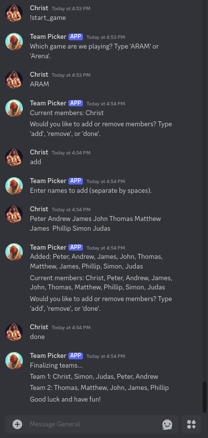

# Discord Team Picker Bot

A simple Discord bot that organizes players into random teams for **ARAM** and **Arena** game modes.

## Features

- Automatically detects members in a voice channel
- Supports adding and removing members before starting
- Creates balanced teams for **ARAM** (max 5 per team) and **Arena** (2 per team)
- Supports rematching with shuffled teams

## Commands

- `!start_game` - Starts a new game session
- `!rematch` - Randomizes teams again without selecting a new game mode
- `!list` - Lists the current members in the pool



## Installation
Clone the repository:

If you're using GitHub Desktop, click Clone or download on the repository page, then choose Open with GitHub Desktop.
Alternatively, you can download the repository as a ZIP file and extract it to your local directory.
Install dependencies: Open a terminal or command prompt in the folder where you downloaded/cloned the repository and run:

```
pip install -r requirements.txt
```
Set up your bot token in a .env file:

Go to the Discord Developer Portal.
Select your application (bot) from the list.
In the Bot section, click Copy Token.
Create a file named .env in the root of your project and add the following line:
```
DISCORD_TOKEN=your-bot-token-here
```
Grab your voice channel ID:

In Discord, right-click the voice channel you want the bot to monitor.
Click Copy ID (make sure Developer Mode is enabled in your Discord settings).
Replace YOUR_VOICE_CHANNEL_ID in the code with the ID you just copied.
Run the bot: In your terminal or command prompt, navigate to the folder where the bot is located and run the following command:

```
discord-team-picker.py
```
This will start the bot. Make sure to replace YOUR_BOT_TOKEN in the code with the actual token from your bot.
